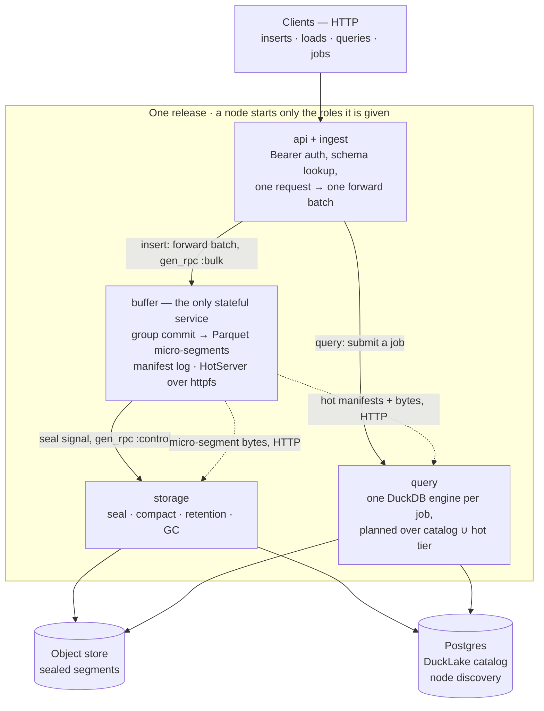
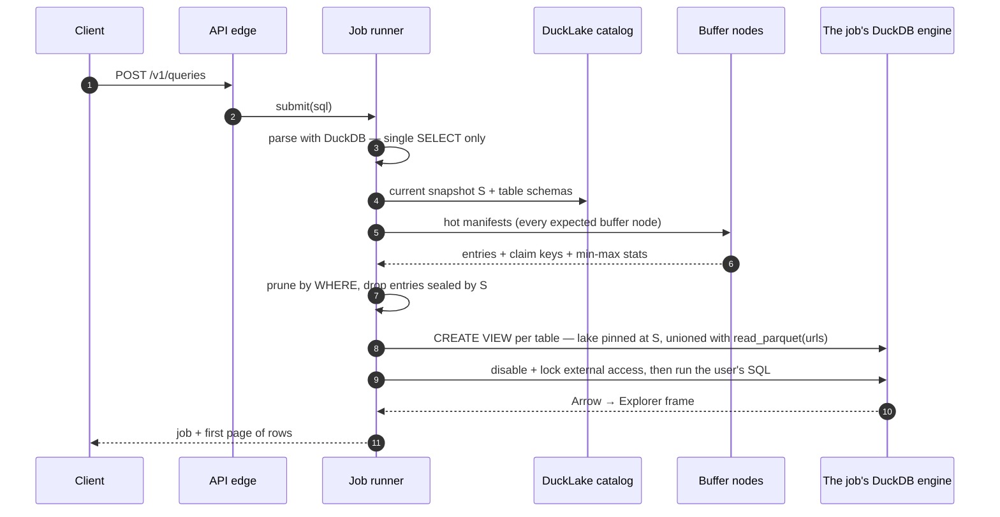

# Architecture

How smolquery works under the hood. The [README](../README.md) gives the
one-screen version; this is the deep dive.

One Elixir app, four services plus two edges, enabled per node by role config.
The storage of record is immutable Parquet plus a DuckLake catalog; DuckDB is a
disposable read engine over it.

## System overview



Three rules shape everything below:

- **The default write path is columnar.** The ingest edge forwards NDJSON bytes
  to the buffer owner, and DuckDB's `COPY ... read_json` parses and writes
  immutable Parquet at flush time — small in (a ~1 s group commit is what
  "durable and queryable" means), large out (a few big files on object storage).
- **DuckDB is a disposable, stateless read engine.** Storage of record is
  Parquet plus a DuckLake catalog (SQLite in dev, Postgres in a cluster). Any
  engine can be thrown away and restarted.
- **Only the buffer service is stateful**, holding seconds-to-minutes of
  unsealed data. Everything else scales elastically.

## The read engine

`Smolquery.Engine` is a supervised `Smolquery.DuckDB` → `Adbc.Connection`
subtree — `Smolquery.DuckDB` wraps `Adbc.Database` and pins the packaged
driver version — with extensions and session settings applied before the
connection is reachable. Every instance spills to its own directory under
`SMOLQUERY_SPILL_DIR`, so two concurrent spills never share temp files:

```elixir
{:ok, _pid} = Smolquery.Engine.start_link(name: MyEngine)

Smolquery.Engine.query!(MyEngine, "SELECT $1::int + 1 AS n", [41])
#=> %Smolquery.Engine.Result{columns: ["n"], rows: [[42]], num_rows: 1}
```

It reads Parquet segments from local disk and over HTTP (`httpfs`), and unions
both in a single plan — the shape a real query takes across the sealed and hot
tiers:

```sql
SELECT * FROM read_parquet('/segments/sealed.parquet')
UNION ALL
SELECT * FROM read_parquet('http://buffer-node:4000/hot.parquet')
```

There are two result contracts, chosen by how big the answer might be.
`query/3` returns a `Smolquery.Engine.Result` — ordered column names plus row
lists of plain Elixir terms, so callers never see Arrow or ADBC types. That
conversion costs about a kilobyte and 2 µs per row, which is free for the
queries the system asks itself and ruinous for a user query matching millions of
rows, so `query/3` refuses a result over `:max_result_rows` (default 100 000)
instead of spending the heap.

`frame/3` is the read path for results nobody sized in advance. DuckDB's Arrow
stream goes straight to Polars in Rust, so no row becomes an Elixir term, and
the frame serializes to Parquet or Arrow IPC from Rust as well:

```elixir
{:ok, frame} = Smolquery.Engine.frame(MyEngine, "SELECT * FROM lake.analytics.events")
{:ok, parquet} = Explorer.DataFrame.dump_parquet(frame)
```

Five million rows take 307 ms and no measurable heap that way, against 11.5 s
and 4.8 GiB through `query/3` — see [benchmarks](benchmarks.md).

## Segments and the catalog

The storage of record: write-once Parquet segments plus a DuckLake catalog.
`Smolquery.Segments.Writer` encodes rows through Explorer (Polars), naming each
segment with a ULID; a `Smolquery.Segments.Store` commits the bytes and owns
what "durable" means. `Smolquery.Catalog` registers those files without copying
them:

```elixir
schema = Smolquery.Schema.new!([{"id", :int64, nullable: false}, {"ts", :timestamp}])
store = Smolquery.Segments.Store.Local.new(dir: "priv/data/segments")

{:ok, segment} = Smolquery.Segments.Writer.write(rows, schema, store: store)

{:ok, _lake} =
  Smolquery.Catalog.DuckLake.start_link(
    name: MyLake,
    metadata: "sqlite:priv/data/catalog.sqlite",
    data_path: "priv/data/ducklake"
  )

catalog = Smolquery.Catalog.DuckLake.new(engine: MyLake)

:ok = Smolquery.Catalog.create_dataset(catalog, "analytics")
:ok = Smolquery.Catalog.create_table(catalog, {"analytics", "events"}, schema)
{:ok, snapshot} = Smolquery.Catalog.register_segments(catalog, {"analytics", "events"}, [segment])

Smolquery.Engine.query!(MyLake, ~s|SELECT count(*) FROM lake."analytics"."events"|)
```

Properties worth knowing:

- **The store owns durability, and it is swappable.** `Store.put/3` returns only
  once the segment is durable *by that store's definition*, so everything above
  it — including the buffer service's "acked means durable" promise — is written
  against one contract and never names a storage medium. `Store.Local` fsyncs
  the file and renames it into place, both under one root, so a reader sees
  either nothing or a complete segment. It fsyncs contents, not the directory
  entry (Erlang cannot fsync a directory without a NIF): an acked segment
  survives a process, BEAM, or node crash, and a hard power cut can lose the
  rename — a strictly smaller window than this store's single-copy exposure to
  losing the disk. `Store.shared?/1` says whether a segment's location means
  anything from another node, which is what decides whether it needs serving
  over HTTP.
- **Registration is idempotent.** `register_segments/3` diffs against the paths
  the catalog already holds, because DuckLake itself would happily register a
  path twice and double-count its rows. A sealer that crashed mid-handoff can
  retry safely.
- **Snapshots are the read contract.** Every mutation reports the snapshot it
  committed at, and `segments/3` lists a table's files as of a snapshot — the
  basis of exactly-once sealing.
- **Pruning is free, but only if the parameter types match.** DuckLake reads
  each Parquet footer at registration and keeps min-max stats, so a filtered
  query touches only the segments it must. A segment also carries its own stats
  for the hot tier. Pruning is lost silently — right rows, every file read —
  when a predicate compares mismatched types, so `Smolquery.Engine.Params` binds
  timestamps to the type the columns declare instead of letting ADBC infer one.
- **Compaction is not free.** `ducklake_merge_adjacent_files` crashes DuckDB on
  externally-registered files, so smolquery never calls it; compaction is built
  on `replace_segments/4`, which registers the merged segment and drops its
  inputs inside one transaction (`Smolquery.Engine.transaction/2`) so a single
  snapshot carries both — no snapshot ever double-counts the rows or loses them.

Types map through one table in `Smolquery.Schema` — logical type ↔ Explorer
dtype ↔ DuckDB type (`:int64`/`{:s, 64}`/`BIGINT`, `{:numeric, p, s}` ↔
`DECIMAL(p,s)`, and so on).

## The hot tier

`Smolquery.BufferService` owns the promise the rest of the system leans on: rows
are durable when, and only when, the owning buffer node has persisted them.
Writes go through one client module and come back acked:

```elixir
batch = %{schema: schema, rows: [%{"id" => 1, "ts" => ~N[2026-07-31 12:00:00]}]}

{:ok, ack} =
  Smolquery.BufferService.Client.write_batch(
    Smolquery.BufferService,
    {"analytics", "events"},
    batch
  )
#=> {:ok, %{segment_id: "01K...", row_count: 1}}

{:ok, entries} =
  Smolquery.BufferService.Client.hot_manifest(Smolquery.BufferService, {"analytics", "events"})
```

What that ack means:

- **One event makes rows durable *and* queryable.** Batches group-commit into a
  micro-segment; the ack is withheld until the segment is in the store and its
  entry is fsynced into the table's manifest log. There is no second mechanism
  for read-your-writes — the manifest a query plans against is the thing that
  made the rows durable.
- **The manifest log is the authority, not the directory.** On restart a table's
  buffer replays its log and reconciles against the store: a segment with no log
  record was never acked and is deleted (adopting it would double-count a
  client's retry), and a record whose segment is gone is dropped.
- **Backpressure is immediate, and it bounds latency, not just memory.** A batch
  that would exceed `max_buffered_rows` or `max_buffered_bytes` gets
  `{:error, :buffer_full}`; a batch whose Little's-law wait estimate exceeds
  `ack_budget_ms` gets `{:error, {:overloaded, predicted_ms}}` before it ever
  reaches the buffer's mailbox (an unbounded 6 s p50 under overload becomes
  p99 ≤ the budget — [benchmarks](benchmarks.md)). The ingest edge turns both
  into a 429, with the prediction as `retry-after`.
- **One table, one node.** `Smolquery.BufferService.Ring` maps a table to its
  owning buffer node by consistent hashing; a call for a table this node does
  not own is forwarded to the owner rather than refused. Clustered, the ring
  tracks live membership through `:pg`; single-node, it is just `[node()]`.
- **Ownership is fenced by epoch (T-92).** `:pg` is eventually consistent, so
  two nodes can transiently each believe they own the same table. Clustered,
  `Smolquery.BufferService.RingEpoch` anchors the member list to a
  compare-and-swap epoch in Postgres (the same database discovery and the
  catalog already use) and refuses writes the epoch-stamped configuration
  does not permit: a non-owner answers `{:error, :not_owner}`, a node that
  just acquired a table waits out the previous owner's lease
  (`{:error, :ownership_settling}`), and a node that cannot verify its
  configuration within `epoch_lease_ms` (default 10s) fails closed
  (`{:error, :ring_config_stale}`). All three surface as a 503 with
  `retry-after`; Postgres being unreachable for longer than one lease
  therefore pauses buffer writes rather than risking a dual owner.
- **The loss window is honest.** With the default local store, a buffer node's
  disk holds a single copy of its unsealed tail: acked rows survive a process,
  BEAM, or node crash, and losing the disk loses that tail. Sealing is what
  bounds it. What a commit requires beyond the local disk before it acks is a
  seam, not a constant: `Smolquery.BufferService.Replicator` (default
  `Replicator.None`, the single-copy policy above) is where segment shipping
  (T-96) or a shared-store manifest policy (T-26) plugs in without the group
  commit knowing which.
- **Segment shipping closes the window (T-96).** With
  `Replicator.SegmentShipping` (`SMOLQUERY_BUFFER_REPLICATION=2`), a group
  commit ships the encoded segment and its manifest entry to the next
  `replication_factor - 1` ring successors and waits for their fsync before
  any ack — one round-trip per flush, amortized like the fsync. The ack rule
  is all-replicas: a follower down fails the write honestly, a ring smaller
  than the factor refuses writes as `underreplicated`, and a failed shipment
  compensates the owner's local commit away so no side keeps rows the caller
  was told failed. Claims, retires, and drops replicate too (followers first
  — they are idempotent), a follower's disk stays `Adopter`-replayable
  (promotion is the existing boot recovery), and seal signalling gates on
  epoch ownership so only one manifest ever freezes a claim.
- **A batch with an id is exactly-once; one without is at-least-once.** A batch
  carrying a `:batch_id` idempotency key can be retried through any failure — a
  lost ack, a transport timeout, a buffer crash-before-reply — and its rows land
  once: the ids are fsynced in the manifest log record with the commit they
  belong to, so the dedup index survives a restart, and a retry of a committed
  batch is answered with the original ack before it is even admitted. An id
  lives as long as its entry (through seal and grace), which comfortably covers
  any retry loop. The API's `insertId` is where one comes from.

### Inter-node transport

Calls reach the owning node through a transport seam rather than a hardcoded
hop. `Client` resolves ownership and dispatches; `Transport.Local` is a direct
call for a table this node owns, and `Transport.GenRpc` carries the rest over
`:gen_rpc`:

```elixir
config :gen_rpc,
  tcp_server_port: 5369,
  tcp_client_port: 5369,
  rpc_module_control: :whitelist,
  rpc_module_list: [Smolquery.BufferService.Endpoint]
```

- **Not Erlang distribution.** Forward-batches are large and constant; on the
  cluster's single distribution connection they would sit in front of heartbeats
  and monitors, and a `busy_dist_port` stall looks to OTP like nodes going down.
  gen_rpc carries this traffic on its own sockets.
- **Bulk and control are separate channels.** gen_rpc keys one connection per
  destination, so routing everything at a node through one key just moves the
  head-of-line blocking onto that socket. Writes travel on `:bulk`, manifest
  reads and retirements on `:control`.
- **The allowlist is not optional.** gen_rpc's default `rpc_module_control` is
  `:disabled`, which lets any peer holding the cookie run arbitrary MFAs on a
  second port. Naming `Endpoint` — the single module every transport dispatches
  to — closes that. Per-node TLS is the other half (`GEN_RPC_TLS`).
- **Ownership routes, it does not refuse.** A call for a table this node does
  not own is forwarded, and `Routing` answers ownership from configuration even
  on a node running no buffer at all — which is what lets a query node ask a
  buffer node for a hot manifest.

### Serving the hot tier over HTTP

Segment *bytes* deliberately do not travel over gen_rpc: DuckDB opens them
itself via `httpfs`, reading only the column chunks a query needs. Pulling them
through RPC would put every segment on the BEAM heap and lose that pushdown.

`Smolquery.BufferService.HotServer` is what DuckDB opens them from — a Bandit
listener, one per instance, serving two routes behind the internal secret
(`Smolquery.InternalSecret`, sent as `x-smolquery-internal`):

```
GET /v1/datasets/:dataset/tables/:table/manifest                  # JSON entries
GET /v1/datasets/:dataset/tables/:table/segments/:id.parquet      # segment bytes
```

- **A manifest entry's `url` is built from the request that fetched it**, not
  from static configuration — the same response is correct whether this bound
  its configured port or an OS-assigned one, and whether it sits behind a proxy
  or not. An entry backed by a *shared* store (one where
  `Smolquery.Segments.Store.shared?/1` is `true`, e.g. a future S3 hot tier)
  reports that store's own location instead, and never round-trips through this
  route at all.
- **A segment id is validated and resolved through the manifest**, never by
  joining request input into a path — `Smolquery.Segments.Id.valid?/1` rejects
  anything that isn't a well-formed ULID before it gets near the filesystem.
- **Both routes answer `HEAD` as well as `GET`**, because `httpfs` sends a
  `HEAD` first to learn a segment's size before issuing the ranged reads
  Parquet's footer-first format needs.

### Claims — how a seal is frozen

The other half of the hot tier is handing data off. A table that crosses
`seal_max_bytes`, `seal_max_files`, or `seal_max_age_ms` signals a configured
consumer, and a sealer stamps the segments it committed:

```elixir
config :smolquery, Smolquery.BufferService, seal_consumer: {MyApp.Sealer, []}

:ok = Smolquery.BufferService.Client.retire(Smolquery.BufferService, table, ids, snapshot)
```

- **What gets signalled is a frozen claim, not the tail as it stands.** Crossing
  a threshold first writes a `claim` record to the manifest log — the
  micro-segment ids, plus the key of the sealed segment they will become,
  derived from those ids — and only then signals. Rows written afterwards wait
  for the next claim. A sealer therefore merges the same inputs into the same
  output no matter how many times it is told or which side crashed, which is
  what makes retrying safe instead of duplicating rows.
- **A claim holds the oldest unsealed entries up to 16 × `seal_max_bytes`**
  (T-246, T-247). The byte valve bounds one sealed segment and the bytes the
  merge stages. Within a claim, the merge bounds its own engine calls: it
  reads an input list over `merge_inputs_per_call` in capped chunks into a
  temp table, then one `COPY` writes the segment. No `read_parquet` call is
  unbounded. A backlog past the valve retires in valve-sized claims, back to
  back, so a table under sustained ingest self-corrects. A custom
  `seal_consumer` receives claims up to the valve and must bound its own
  engine calls the same way.
- **The claim is how a query planner dedups, exactly.** Each manifest entry
  carries its claim's `claim_keys`, so at catalog snapshot `S` the rule is:
  include a micro-segment unless its claim's keys are all in the catalog's
  segment list at `S`. Since the commit that adds those keys is atomic, a
  micro-segment stops counting at the instant its rows start counting — there is
  no window where both tiers hold them, which snapshot-stamp comparison could
  not achieve.
- **Retiring one member of a claim retires all of them**, because the sealed
  segment holds every input's rows. Stamping only some would leave the rest
  claimed but unsealed, and the next re-signal would rebuild that claim's
  segment from a subset — overwriting a committed segment with fewer rows.
- **The signal is level-triggered, not an event.** It repeats every
  `seal_retry_ms` until the claim is retired, so a sealer that dies mid-handoff
  costs a retry interval rather than leaving that table's tail parked forever.
  Consumers should expect repeats, and can rely on them being identical.
- **Retirement is a stamp, not a delete.** `retire/4` records the catalog
  snapshot the sealer committed at and leaves the segments readable, because a
  query planned at an older snapshot is still entitled to them. Deletion happens
  `retire_grace_ms` later, which must exceed the longest query a planner can
  hold open. Retiring an already-sealed id, or one the sweep has already
  deleted, is `:ok` — every direction a crashed sealer retries from.
- **Boot adopts what is already on disk.** A buffer is what runs the seal check,
  so a node restarting with an unsealed tail for a table nobody writes to again
  would strand it. `Smolquery.BufferService.Adopter` starts a buffer for every
  owned table with a manifest log, and does it before the subtree reports
  started — a query arriving mid-adoption would otherwise read an empty manifest
  and quietly return results missing that table's unsealed rows.

## The sealed tier

`Smolquery.StorageService` owns what happens after the hot tier: merge a table's
micro-segments into large sealed segments, commit them to the catalog, retire
the inputs. Started by the `:storage` role, it is where seal signals go —

```elixir
config :smolquery, Smolquery.BufferService,
  seal_consumer: {Smolquery.StorageService.Client, []}
```

— and the buffer service still names no storage module of its own, which is why
that wiring is configuration.

### Scheduling

- **One seal in flight per table, a bounded pool per node.**
  `Smolquery.StorageService.Sealer` coalesces a signal for a table it is already
  sealing and sheds one arriving at `max_concurrent_seals`. Both are safe
  because signalling is level-triggered — a dropped signal costs a
  `seal_retry_ms` delay, never a lost seal, so the sealer needs no queue of its
  own.
- **An attempt runs as a monitored task, not a linked one.** A merge that
  crashes frees its table and leaves the sealer and its siblings alone; the next
  re-signal retries it.
- **A claim that can never seal retries forever, and is counted while it does.**
  Bounding the retries would be worse — the buffer holds the only durable record
  of what wants sealing, so giving up strands a table's tail with nothing left
  to notice. `Sealer.failures/1` reports consecutive failed attempts per table,
  cleared by the first success, and the log escalates from a warning to an error
  once a table stops looking transient. Distinguishing "retrying" from "stuck"
  is the part that was missing; stopping is not.
- **A signal is routed to its ring owner, not cast blindly to whatever node
  raised it.** `Smolquery.StorageService.Client` resolves `table_ref`'s owner
  through `Smolquery.StorageService.Routing` — a second `Ring`, keyed by the
  storage-node subset of cluster membership rather than the buffer's — and casts
  to that node directly, the same way `Sealer` and `Compactor` gate on
  `Routing.own?/2` before acting on a signal or a sweep's table so two storage
  replicas never double-merge the same one. Only a cluster with no storage node
  reachable anywhere is reported rather than raised — raising would take down the
  `TableBuffer` that signalled, and it signals from the write path.
- **Sealed segments get their own store handle**, separate from the buffer's.
  The two tiers have opposite write profiles — one put per flush against one per
  seal — and that difference is what makes an object store plausible here long
  before it is for the hot tier.

### The merge

`Smolquery.StorageService.Merge` turns a claim into one sealed segment inside
DuckDB, writing straight to the store's staging path:

```sql
COPY (SELECT <the catalog's columns> FROM read_parquet([urls], union_by_name := true))
TO staged
```

- **No segment's bytes become an Elixir term**, which matters most for the
  largest objects the system writes. Same reason the segment writer hands Polars
  a path.
- **The inputs come over HTTP**, from `HotServer`. The bytes have to travel that
  way regardless — `httpfs` speaks HTTP and nothing else — so the manifest comes
  the same way, and a remote buffer node needs nothing new in a cluster.
- **`union_by_name` is what makes additive schema evolution work**:
  micro-segments written before and after a column was added merge into one
  segment carrying the union.
- **But the union of the inputs is not the schema the catalog declares**, and
  registration compares against the catalog. A claim whose inputs *all* predate
  an added column unions to the older, narrower schema, and `add_data_files`
  rejects the file — a rejection no retry can clear, because the claim's input
  set is frozen. So the merge projects onto the catalog's columns instead: each
  declared column in the catalog's order, cast to the catalog's type, and one
  the inputs do not carry as a typed `NULL`. The sealed file matches the table by
  construction.
- **A column the inputs carry and the catalog does not is an error**
  (`{:error, {:undeclared_columns, names}}`), refused before any byte moves.
  Projecting it away would silently drop a column of acked rows, which is worse
  than a stuck claim; widening the table is the catalog's call, not the sealer's.
- **The output key comes from the claim, not from the merge**, so a retry is an
  idempotent overwrite of identical rows rather than a second segment.
- **An input the manifest no longer lists is skipped, not fatal** — its rows are
  gone either way, and refusing would strand the table's whole tail on one lost
  file. A claim with nothing left is an error rather than an empty segment.

### The handoff

`Smolquery.StorageService.Handoff.Seal` composes that into the whole handoff,
and this is the one cross-service dance in smolquery:

```
merge → put → register → retire
```

An attempt starts by asking the catalog whether the claim's sealed segment is
already registered. If it is, some earlier attempt got that far before dying,
and this one skips to retirement. So a crash costs a `seal_retry_ms` delay and
nothing more, at every point:

- **before the commit** — nothing is registered, so the next attempt merges
  again, overwriting its own half-written output at the same key.
- **after the commit, before retirement** — the rows are in the sealed tier and
  the micro-segments are still unretired. This is exactly the window the
  catalog-membership rule is built for: a query at any snapshot counts them
  once. The next attempt finds the keys registered and retires.
- **after retirement** — nothing left to do; a repeated retire is `:ok`.

Retirement goes through `BufferService.Client`, not HTTP: it is a control-plane
call with no bulk data, `HotServer` is read-only, and the client already owns
ownership routing and idempotence. Same bulk/control split the buffer draws
internally.

A table the catalog does not hold is an error rather than something the sealer
creates — the ingest edge validated against the catalog before forwarding, so a
table with micro-segments is a table the catalog already knows.

### Garbage collection

`Smolquery.StorageService.GC` collects the one kind of garbage this can leave: a
segment put but never registered, because an attempt died in between. Nothing
will ever name it — the next attempt writes the same key and registers that one.

- **The test is membership in every snapshot, not the current one.** A path
  dropped from the current snapshot is still the only copy of rows an older
  snapshot can read, so `Catalog.known_segments/1` spans all of history.
  Reclaiming expired snapshots' files is retention's job, not GC's.
- **Two sightings, not a timestamp.** An object is deleted only after being seen
  unreferenced for `gc_grace_ms` continuously. A sealed segment's key encodes
  when its *inputs* were written, so a claim that waited an hour for a sealer
  produces an "old" key the moment it lands — reading the key's age would sweep
  live work. So `gc_grace_ms` must exceed the longest merge, the way
  `retire_grace_ms` must exceed the longest query.
- **Staging is swept too.** A killed encoder leaves half-written bytes in the
  store's `.tmp` directory that no manifest or catalog will ever account for.
  Each GC sweep clears staged files older than the same grace period, and buffer
  nodes clear theirs at boot, before any writer starts.

### Compaction

`Smolquery.StorageService.Compactor` re-merges undersized sealed segments — the
residue of eager and age-cap seals — so a quiet table stops accreting files. It
sweeps every `compact_interval_ms`, needs no signals (the catalog itself says
which segments are small; sizes come from Parquet footers), and per table per
sweep replaces one oldest-first run of segments under `compact_below_bytes` with
a single merged segment, capped at `compact_max_bytes`. The group has no
input-count cap (T-248). The merge reads its inputs in chunks of
`merge_inputs_per_call`, so a backlog of any file count merges in one sweep.
An input-count cap would instead make each sweep re-ingest the previous
sweep's still-undersized output.

- **The swap is atomic.** `Catalog.replace_segments/4` registers the merged
  segment and drops its inputs in one DuckLake transaction, so a single snapshot
  carries both — no snapshot double-counts the rows or loses them. Readers
  pinned at earlier snapshots keep reading the old files; GC reclaims them once
  no snapshot references them.
- **The swap is verified.** File-level drops only work because the lake is
  attached with `DATA_INLINING_ROW_LIMIT 0`; broken, the symptom is silently
  slower queries. After every swap the compactor re-reads `segments/3` and fails
  loudly if a dropped path survived.
- **A retry overwrites, never duplicates.** The merged segment's id derives from
  the sorted input ids, the same identity rule sealing uses, so a compaction that
  crashed before its swap re-plans the same group into the same key next sweep.

### Clustering key

A table may declare a clustering key — smolquery's analog of ClickHouse's
`ORDER BY`. It is metadata, set by `PATCH`ing the table with
`{"clustering": ["project_id", "ts"]}` and cleared with `{"clustering": []}`;
the columns must exist on the schema or the request is a 422. The key is
persisted in a `smolquery_clustering` side table beside retention's, read back
onto `Smolquery.Schema.clustering`, and carried through the ingest schema cache
into every flush. Both side tables carry a primary key so a Postgres metadata
database whose tables a publication covers (CDC, logical replication) still
accepts the `DELETE`s their writes start with — the replica-identity refusal
that makes DuckLake's own PK-less stats tables unusable under one. A `PATCH`
setting retention and clustering together applies them in one metadata
transaction: on error, neither sticks.

When `clustering` is non-empty, rows are stably sorted by those columns in
declared order with nulls last at every write point: the buffer's micro-segment
flush (`Smolquery.Segments.Writer`), the seal merge, and compaction (`ORDER BY`
on the storage service's `COPY`). There is no new index structure — the sorted
Parquet's row-group min/max stats are the sparse index, which is why the sealed
tier's `ROW_GROUP_SIZE` is explicit configuration (`seal_row_group_size`) rather
than a DuckDB default. The write path pays for it: flush throughput at
saturation is **~7%** slower — Polars sorts the built frame in Rust, and on the
ack path the [ack budget](benchmarks.md) governs — and seal merge peaks
**~+180 MiB** higher in transient OS RSS under `memory_limit`
([`bench/results/clustering.md`](../bench/results/clustering.md)).

The sort compares column values logically, in Polars, never Elixir terms:
Erlang term order on `NaiveDateTime`/`Date`/`Decimal` structs is not
chronological (struct fields compare alphabetically, `:day` before `:month`),
so sorting row maps with `Enum.sort_by` would order January 31 after
February 1.

Two properties keep the key from ever being able to break a write. An empty
clustering key is a hard no-op, so a table without one behaves exactly as
before. And both sort points intersect the key with the schema's own field names
first: the side table outlives a `DROP TABLE`, so an operator who recreates a
table narrower would otherwise leave an `ORDER BY` naming a column that no longer
exists — a merge that fails identically on every retry, which strands the claim
and pins the table's tail in the hot tier forever.

Setting or clearing a key affects future writes only. Existing segments are
never rewritten.

### Retention and snapshot expiry

`Smolquery.StorageService.Retention` ages data out, for tables that opt in with
a policy (`PATCH` the table with `{"retention": {"column": ..., "ttlMs": ...}}`).
Nothing ever deletes rows: the unit of expiry is the whole segment, dropped only
once the *maximum* of the policy column across its rows has passed the horizon
(read from Parquet footer stats), so a segment straddling the boundary keeps all
its rows until it ages out entirely. Missing or unreadable stats mean the
segment is kept — retention that guesses is deletion.

Each retention sweep ends by expiring catalog snapshots older than
`snapshot_keep_ms`. That is what turns any logical drop — retention's or
compaction's — into a physically reclaimable file: GC spares every path some
snapshot still references, and only expiry makes that test say no. The
verification is pinned in the DuckLake tests: `ducklake_expire_snapshots` is
sound over externally-registered files (a pinned read of an expired snapshot
fails cleanly, `known_segments/1` shrinks, the current snapshot survives).
`snapshot_keep_ms` is the deployment's time-travel promise and must exceed the
longest pinned query — and the buffer's `retire_grace_ms`, because expiry erases
the registration history the planner's seal-membership rule reads (defaults:
24 h against 10 min).

## Queries

`Smolquery.QueryService` is the read path: async query jobs planned against the
catalog ∪ the hot tier, started by the `:query` role. The surface is
`Smolquery.QueryService.Client`:

```elixir
{:ok, job, frame} = Smolquery.QueryService.Client.query(Smolquery.QueryService,
  "SELECT count(*) FROM analytics.events")

{:ok, job} = Smolquery.QueryService.Client.submit(name, sql)   # async
{:ok, job, frame} = Smolquery.QueryService.Client.fetch(name, job.id)
:ok = Smolquery.QueryService.Client.cancel(name, job.id)
```

Each job runs in its own process with its own private DuckDB engine — two jobs'
views never collide, cancellation kills the engine and the query dies with it,
and `job_memory_limit` binds one job, not the node. The engine costs ~50 ms to
start, which an async job never notices.



The planner never rewrites SQL. For each table the query references (found with
DuckDB's own parser, which doubles as the read-only gate — only a single SELECT
serializes), it creates `<dataset>.<table>` as a view in the job engine's own
catalog, shadowing the attached lake:

```sql
CREATE VIEW "analytics"."events" AS SELECT "id", "ts" FROM (
  SELECT * FROM "lake"."analytics"."events" AT (VERSION => 42)   -- sealed, pinned
  UNION ALL BY NAME
  SELECT * FROM read_parquet(['http://…/01A.parquet'], union_by_name := true)
)
```

Properties worth knowing:

- **One snapshot per job, and rows count exactly once while sealing — and
  compaction — run underneath.** The sealed side is pinned `AT (VERSION => S)`;
  a hot micro-segment is included iff it carries no claim or its claim's sealed
  keys were not all *registered by* `S` (`Catalog.registered_through/3`, not the
  at-`S` file listing: compaction may have dropped a sealed file a live hot
  entry still names, and a drop never un-commits a seal). The commit that makes
  rows appear in the sealed tier is the same event that excludes their
  micro-segments — no gap, at any crash point, which the reader-side and
  maintenance crash matrices walk through the public surface.
- **Hot rows have no snapshot.** An acked write is visible to the next query —
  read-your-writes, not an inconsistency.
- **Both tiers project onto the catalog's schema.** A micro-segment written
  before a column was added reads back with NULLs there, the way a sealed
  segment does.
- **Manifest-level pruning drops hot files before DuckDB pays an HTTP footer
  read for each** (~0.7 ms/file): top-level WHERE conjuncts against flush-time
  min-max stats, conservative in every uncertain case. The sealed tier prunes
  itself — DuckLake keeps stats at registration.
- **An unreachable buffer owner fails the query.** Sealed-only rows behind a
  green status would be a wrong answer.
- **User SQL is locked down.** After planning, each job engine disables DuckDB's
  external access for the user's SQL, leaving readable exactly the runtime's
  `allowed_directories` (the data dir and catalog paths by default) plus the
  plan's own micro-segment URLs — `read_csv('/etc/passwd')` is a permission
  error, and the configuration is locked so SQL cannot turn it back on.
  `lockdown: false` restores the trusted posture; a deployment whose sealed
  segments live outside the data dir names them in `allowed_directories`.

### Clustered fan-out

Clustered, the planner ignores `buffer_base_url` and instead fans each table's
manifest fetch out to *every* ring member, at URLs derived from node names
(`http://<host-part-of-node-name>:<buffer_hot_port>`). Every member, not just
the table's current owner, because a ring change moves ownership instantly while
the previous owner still holds the table's acked, unsealed tail — asking only
the new owner would silently drop those rows from results until they seal.

"Member" means the live ring *plus* the fleet `SMOLQUERY_BUFFER_NODES` says to
expect, because a crashed node leaves `:pg` indistinguishably from a drained one
and would otherwise be absent rather than unreachable. Any member that cannot
answer fails the whole plan with a `503`, the same honesty as single-node. It is
deliberately coarse — one dead buffer node fails every query, not only those
over tables it held — because nothing durable records which nodes hold unsealed
rows for which table; a per-table holder registry would narrow it (tracked as
T-95).

`Smolquery.BufferService.Drain.drain/2` is the planned counterpart: it takes a
node out of the ring on purpose — force-sealing everything it owns and waiting
for the seal to land before it stops being an owner, so a planned fleet shrink
loses nothing an unplanned node death wouldn't already risk. A drained node is
still expected to answer reads until it is dropped from
`SMOLQUERY_BUFFER_NODES`; since draining leaves it holding nothing, it answers
an honest empty manifest. The order to shrink by is drain, stop, then
un-configure.

## Roles

One release, four services plus two edges — the HTTP front door and the web UI.
A node starts only the subtrees its roles name; `SMOLQUERY_ROLES` is a
comma-separated list, or `all`:

```sh
SMOLQUERY_ROLES=all                # default when unset — single-node dev
SMOLQUERY_ROLES=query              # a query-only node
SMOLQUERY_ROLES=api,ingest,buffer
SMOLQUERY_ROLES=web,query          # the UI and the jobs it runs
```

| role | subtree |
|---|---|
| `api` | `SmolqueryApi` — the HTTP front door, a Phoenix endpoint on Bandit |
| `ingest` | `Smolquery.IngestService` — schema lookup and batching; validation is deferred to flush/salvage |
| `buffer` | `Smolquery.BufferService` — the hot tier and `HotServer` |
| `storage` | `Smolquery.StorageService` — seal, compact, retention, GC |
| `query` | `Smolquery.QueryService` — query jobs |
| `web` | `SmolqueryWeb` — the LiveView UI |

Unknown role names fail the boot rather than silently starting nothing. See
`Smolquery.Roles`.

A cluster is `CATALOG_DATABASE_URL` plus one Postgres every node can reach —
nothing else to stand up. It tiers the DuckLake catalog onto Postgres and
enables node discovery (`Smolquery.Cluster`, over `libcluster_postgres`) through
that same database. Setting it also flips `HotServer`'s bind from loopback to
`0.0.0.0`, since peers read each other's hot tiers over HTTP.

## Observability

Every service emits plain `:telemetry` events at its seams — ingest
accept/reject, buffer group commits (count, rows, time), admission refusals,
batch-dedup hits, seal attempts, compaction swaps, retention drops, snapshot
expiry, GC sweeps, terminal query jobs, API requests. `Smolquery.Telemetry`
aggregates them into counters and `GET /metrics` renders Prometheus text; an
exporter wanting a different backend attaches to the same events without
touching a call site. Counters only, with paired totals for means
(`smolquery_buffer_commit_microseconds_total / smolquery_buffer_commits_total`),
and labels drawn from closed sets so cardinality is bounded by code, not
traffic.

Terminal jobs are recorded in a `smolquery_jobs` table inside the same SQLite
database that backs the DuckLake catalog (via DuckDB's `sqlite` extension), so
job status outlives the result TTL even though the rows do not.

## Security posture (v1)

Three layers, each fail-closed:

- **The front door** requires the static Bearer key on every `/v1` route; a node
  holding the `:api` role with no key refuses to boot.
- **Internal HTTP** (`HotServer`'s manifest and segment routes) requires the
  internal secret; readers attach it — `HotClient` as a header, the DuckDB
  engines via an http `CREATE SECRET`. A single node generates one at boot; a
  cluster sets `SMOLQUERY_INTERNAL_SECRET` everywhere or reads fail with 401s.
- **User SQL** runs with DuckDB's external access disabled and locked after
  planning: readable is exactly `allowed_directories`, the micro-segment URLs
  the plan itself produced, and the sealed tier's `s3://<bucket>/` prefix when
  the sealed tier is an object store.

Single-tenant remains the model — auth says *whether* you may query, not *which
tables*. Inter-node traffic can be switched to mutual TLS (`GEN_RPC_TLS`,
`DIST_TLS`); verification is chain-only against the cluster CA, so the CA is the
trust boundary. The web UI requires its own basic-auth credential
(`SMOLQUERY_WEB_USERNAME` / `SMOLQUERY_WEB_PASSWORD`). The credential is not
the API key, so a UI rotation does not break an ingest client. A rotation also
revokes existing UI sessions. The UI binds loopback by default. A node with
the `:web` role refuses to boot without the credential.

## See also

- [Configuration reference](configuration.md) — every environment variable and
  application-config key.
- [HTTP API](api.md) — the `/v1` surface.
- [Benchmarks](benchmarks.md) — the measurements these decisions were made on.
