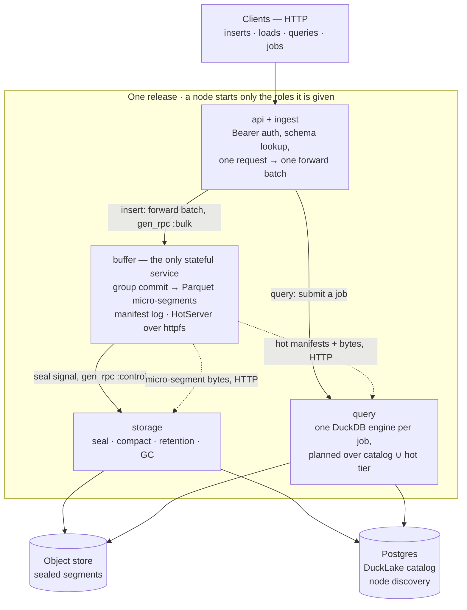
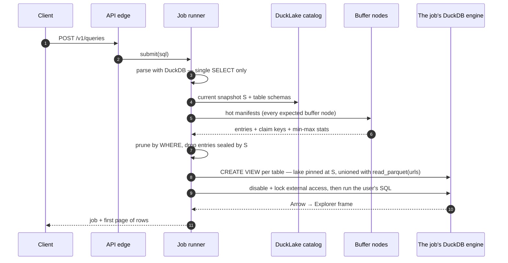

# Architecture

This document explains how smolquery works in detail. The
[README](../README.md) gives the one-screen version.

smolquery is one Elixir app. It holds four services plus two edges. Role config
enables each per node. The storage of record is immutable Parquet plus a
DuckLake catalog. DuckDB is a disposable read engine over that storage.

## System overview



Three rules shape everything below:

- **The default write path is columnar.** The ingest edge forwards NDJSON
  (newline-delimited JSON) bytes to the buffer owner. At flush time, DuckDB's
  `COPY ... read_json` parses the bytes and writes immutable Parquet. Small
  data comes in: a ~1 s group commit is what "durable and queryable" means.
  Large data goes out: a few big files land on object storage.
- **DuckDB is a disposable, stateless read engine.** The storage of record is
  Parquet plus a DuckLake catalog (SQLite in dev, Postgres in a cluster). You
  can discard and restart any engine.
- **Only the buffer service is stateful.** It holds seconds to minutes of
  unsealed data. Every other service scales elastically.

## The read engine

`Smolquery.Engine` is a supervised `Smolquery.DuckDB` → `Adbc.Connection`
subtree. `Smolquery.DuckDB` wraps `Adbc.Database` and pins the packaged driver
version. Extensions and session settings apply before the connection is
reachable. Each instance spills to its own directory under
`SMOLQUERY_SPILL_DIR`. Two concurrent spills therefore never share temp files:

```elixir
{:ok, _pid} = Smolquery.Engine.start_link(name: MyEngine)

Smolquery.Engine.query!(MyEngine, "SELECT $1::int + 1 AS n", [41])
#=> %Smolquery.Engine.Result{columns: ["n"], rows: [[42]], num_rows: 1}
```

The engine reads Parquet segments from the local disk. It also reads them over
the Hypertext Transfer Protocol (HTTP), with `httpfs`. One plan can union both
sources. A real query takes this shape across the sealed and hot tiers:

```sql
SELECT * FROM read_parquet('/segments/sealed.parquet')
UNION ALL
SELECT * FROM read_parquet('http://buffer-node:4000/hot.parquet')
```

The engine has two result contracts. The possible size of the answer selects
the contract.

`query/3` returns a `Smolquery.Engine.Result`: ordered column names plus row
lists of plain Elixir terms. Callers never see Arrow or ADBC (Arrow Database
Connectivity) types. The conversion costs about a kilobyte and 2 µs per row.
That cost is free for the queries the system asks itself. It is too large for
a user query that matches millions of rows. For that reason, `query/3` refuses
a result over `:max_result_rows` (default 100 000) instead of spending the
heap.

`frame/3` is the read path for results nobody sized in advance. DuckDB's Arrow
stream goes straight to Polars in Rust, so no row becomes an Elixir term. The
frame also serializes to Parquet or Arrow IPC from Rust:

```elixir
{:ok, frame} = Smolquery.Engine.frame(MyEngine, "SELECT * FROM lake.analytics.events")
{:ok, parquet} = Explorer.DataFrame.dump_parquet(frame)
```

With `frame/3`, five million rows take 307 ms and no measurable heap. Through
`query/3`, the same rows take 11.5 s and 4.8 GiB. See the
[benchmarks](benchmarks.md).

## Segments and the catalog

The storage of record is write-once Parquet segments plus a DuckLake catalog.
`Smolquery.Segments.Writer` encodes rows through Explorer (Polars). It names
each segment with a ULID (Universally Unique Lexicographically Sortable
Identifier). A `Smolquery.Segments.Store` commits the bytes. The store owns
what "durable" means. `Smolquery.Catalog` registers those files without a
copy:

```elixir
schema = Smolquery.Schema.new!([{"id", :int64, nullable: false}, {"ts", :timestamp}])
store = Smolquery.Segments.Store.Local.new(dir: "priv/data/segments")

{:ok, segment} = Smolquery.Segments.Writer.write(rows, schema, store: store)

{:ok, _lake} =
  Smolquery.Catalog.DuckLake.start_link(
    name: MyLake,
    metadata: "sqlite:priv/data/catalog.sqlite",
    data_path: "priv/data/ducklake"
  )

catalog = Smolquery.Catalog.DuckLake.new(engine: MyLake)

:ok = Smolquery.Catalog.create_dataset(catalog, "analytics")
:ok = Smolquery.Catalog.create_table(catalog, {"analytics", "events"}, schema)
{:ok, snapshot} = Smolquery.Catalog.register_segments(catalog, {"analytics", "events"}, [segment])

Smolquery.Engine.query!(MyLake, ~s|SELECT count(*) FROM lake."analytics"."events"|)
```

Properties worth knowing:

- **The store owns durability. The store is also swappable.** `Store.put/3`
  returns only when the segment is durable *by that store's definition*.
  Everything above the store writes against that one contract. That includes
  the buffer service's "acked means durable" promise. No layer above the store
  names a storage medium. `Store.Local` fsyncs the file, then hard-links it
  into place, both under one root. A reader therefore sees nothing or a
  complete segment. The store fsyncs the contents, not the directory entry.
  Erlang cannot fsync a directory without a NIF (Native Implemented
  Function). An acked segment survives a process, BEAM, or node crash. A hard
  power cut can lose the link. That window is strictly smaller than this store's
  single-copy exposure to a lost disk. `Store.shared?/1` says whether a
  segment's location means anything from another node. That answer decides
  whether the segment needs an HTTP serving path.
- **A committed key can never be blind-overwritten.** `Store.put/3` writes are
  conditional: `Store.S3` sends `If-None-Match: *`, `Store.Local` publishes the
  key with `link(2)`, which is create-if-absent in one atomic step. A retry
  that targets a key an earlier, successful attempt already committed gets
  that rejected (a `412` on S3, `:eexist` locally) and treats it as a no-op
  instead of re-uploading — so a retry that itself dies mid-write can never
  clobber a fully-committed segment with truncated bytes (T-308). The no-op
  reports the committed object's size, not the discarded retry's.
- **A truncated file is refused before it is ever committed.** `Store.put/3`
  checks `Store.validate_parquet/1` — the `PAR1` magic at both ends of the
  staged file, plus the 12-byte structural minimum — right after the encoder
  returns and before the upload or link. The dispatcher wraps the encoder,
  so every implementation gets the check; none can forget it. This is a
  floor, not a footer parse: it catches a write that died partway through,
  not corruption that leaves both magic markers intact. A file the validator
  cannot read reports its posix reason, never `:truncated_parquet` — an
  environment fault is not a corruption verdict (T-309).
- **Registration is idempotent.** `register_segments/3` diffs against the paths
  the catalog already holds. DuckLake itself would register a path twice and
  double-count its rows. A sealer that crashed mid-handoff can retry safely.
- **Snapshots are the read contract.** Every mutation reports the snapshot it
  committed at. `segments/3` lists a table's files as of a snapshot. That
  listing is the basis of exactly-once sealing.
- **Pruning is free, but only if the parameter types match.** DuckLake reads
  each Parquet footer at registration and keeps min-max stats. A filtered
  query then touches only the segments it must. A segment also carries its own
  stats for the hot tier. Pruning is lost silently when a predicate compares
  mismatched types: the query returns the right rows but reads every file. So
  `Smolquery.Engine.Params` binds timestamps to the type the columns declare.
  It does not let ADBC infer one.
- **Compaction is not free.** `ducklake_merge_adjacent_files` crashes DuckDB on
  externally-registered files, so smolquery never calls it. smolquery builds
  compaction on `replace_segments/4`. That function registers the merged
  segment and drops its inputs inside one transaction
  (`Smolquery.Engine.transaction/2`). A single snapshot carries both changes.
  No snapshot ever double-counts the rows or loses them.

One table in `Smolquery.Schema` maps the types: logical type ↔ Explorer
dtype ↔ DuckDB type (`:int64`/`{:s, 64}`/`BIGINT`, `{:numeric, p, s}` ↔
`DECIMAL(p,s)`, and so on). Two types have no Explorer dtype —
`MAP(STRING, STRING)` and `VARIANT` — so only the DuckDB flush writer writes
them, and a variant is stored as `JSON` and cast to `VARIANT` in every table
view, because DuckLake does not register DuckDB's variant Parquet encoding.
The caller-facing limits of both are listed once, in the
[API doc](api.md#schema-types).

## The hot tier

`Smolquery.BufferService` owns the promise the rest of the system depends on:
rows are durable when, and only when, the owning buffer node has persisted
them. Writes go through one client module. The client returns an ack:

```elixir
batch = %{schema: schema, rows: [%{"id" => 1, "ts" => ~N[2026-07-31 12:00:00]}]}

{:ok, ack} =
  Smolquery.BufferService.Client.write_batch(
    Smolquery.BufferService,
    {"analytics", "events"},
    batch
  )
#=> {:ok, %{segment_id: "01K...", row_count: 1}}

{:ok, entries} =
  Smolquery.BufferService.Client.hot_manifest(Smolquery.BufferService, {"analytics", "events"})
```

What that ack means:

- **One event makes rows durable *and* queryable.** Batches group-commit into
  a micro-segment. The service withholds the ack until the segment is in the
  store and its entry is fsynced into the table's manifest log. There is no
  second mechanism for read-your-writes. The manifest a query plans against is
  the same record that made the rows durable.
- **The manifest log is the authority, not the directory.** On restart, a
  table's buffer replays its log. It then reconciles against the store. A
  segment with no log record was never acked, so the buffer deletes it. To
  adopt such a segment would double-count a client's retry. The buffer drops a
  record whose segment is gone.
- **Backpressure is immediate. It bounds latency, not just memory.** A batch
  over `max_buffered_rows` or `max_buffered_bytes` gets
  `{:error, :buffer_full}`. A batch whose Little's-law wait estimate exceeds
  `ack_budget_ms` gets `{:error, {:overloaded, predicted_ms}}`. That refusal
  happens before the batch reaches the buffer's mailbox. Under overload, an
  unbounded 6 s p50 becomes p99 ≤ the budget ([benchmarks](benchmarks.md)).
  The ingest edge turns both errors into a 429. The prediction becomes the
  `retry-after` value.
- **One table, one node.** `Smolquery.BufferService.Ring` maps a table to its
  owning buffer node by consistent hashing. A call for a table this node does
  not own is forwarded to the owner, not refused. In a cluster, the ring
  tracks live membership through `:pg`. On a single node, the ring is
  `[node()]`.
- **Ownership is fenced by epoch (T-92).** `:pg` is eventually consistent. Two
  nodes can therefore transiently each believe they own the same table. In a
  cluster, `Smolquery.BufferService.RingEpoch` anchors the member list to a
  compare-and-swap epoch in Postgres. That is the same database node discovery
  and the catalog already use. RingEpoch refuses writes the epoch-stamped
  configuration does not permit:
  - A non-owner answers `{:error, :not_owner}`.
  - A node that just acquired a table waits out the previous owner's lease:
    `{:error, :ownership_settling}`.
  - A node that cannot verify its configuration within `epoch_lease_ms`
    (default 10s) fails closed: `{:error, :ring_config_stale}`.

  All three surface as a 503 with `retry-after`. When Postgres is unreachable
  for longer than one lease, buffer writes pause. That is safer than the risk
  of a dual owner.
- **The loss window is honest.** With the default local store, a buffer node's
  disk holds a single copy of its unsealed tail. Acked rows survive a process,
  BEAM, or node crash. A lost disk loses that tail. Sealing bounds the window.
  What a commit requires beyond the local disk before it acks is a seam, not a
  constant. `Smolquery.BufferService.Replicator` (default `Replicator.None`,
  the single-copy policy above) is that seam. Segment shipping (T-96) or a
  shared-store manifest policy (T-26) plugs in there. The group commit does
  not know which policy runs.
- **Segment shipping closes the window (T-96).** With
  `Replicator.SegmentShipping` (`SMOLQUERY_BUFFER_REPLICATION=2`), a group
  commit ships the encoded segment and its manifest entry to the next
  `replication_factor - 1` ring successors. It waits for their fsync before
  any ack. That is one round-trip per flush, amortized like the fsync. The
  ack rule is all-replicas:
  - A follower that is down fails the write honestly.
  - A ring smaller than the factor refuses writes as `underreplicated`.
  - A failed shipment compensates the owner's local commit away. No side
    keeps rows the caller was told failed: the drop is shipped with the
    error, and also recorded as *owed* in the manifest log, re-shipped on
    the seal cadence until the replicas ack (F-2, `tla/FINDINGS.md`) —
    a follower copy whose ack was lost would otherwise be served by the
    planner's every-member manifest merge forever.

  Claims, retires, and drops replicate too. Followers go first, because they
  are idempotent. A follower's disk stays `Adopter`-replayable; promotion is
  the existing boot recovery. Seal signalling gates on epoch ownership, so
  only one manifest ever freezes a claim.
- **A batch with an id is exactly-once; one without is at-least-once.** A
  batch that carries a `:batch_id` idempotency key can be retried through any
  failure: a lost ack, a transport timeout, a buffer crash before the reply.
  Its rows land once. The ids are fsynced in the manifest log record with the
  commit they belong to, so the dedup index survives a restart. A retry of a
  committed batch gets the original ack before it is even admitted. An id
  lives as long as its entry, through seal and grace. That span covers any
  retry loop. The `insertId` field of the API (application programming
  interface) supplies the id.

### Inter-node transport

Calls reach the owning node through a transport seam, not a hardcoded hop.
`Client` resolves ownership and dispatches. `Transport.Local` is a direct call
for a table this node owns. `Transport.GenRpc` carries the rest over
`:gen_rpc`:

```elixir
config :gen_rpc,
  tcp_server_port: 5369,
  tcp_client_port: 5369,
  rpc_module_control: :whitelist,
  rpc_module_list: [Smolquery.BufferService.Endpoint],
  extra_process_flags: [fullsweep_after: 20]

config :smolquery, Smolquery.BufferService.Transport.GenRpc, bulk_channels: 4
```

- **Not Erlang distribution.** Forward-batches are large and constant. On the
  cluster's single distribution connection, they would sit in front of
  heartbeats and monitors. A `busy_dist_port` stall then looks to OTP like
  nodes going down. gen_rpc carries this traffic on its own sockets.
- **Bulk and control are separate channels.** gen_rpc keys one connection per
  destination. To route everything at a node through one key only moves the
  head-of-line blocking onto that socket. Writes and replica shipments travel
  on `{:bulk, table_ref}`. Manifest reads and retirements travel on
  `:control`.
- **Bulk is a pool.** The table ref hashes into one of `bulk_channels`
  connections per node pair (`GEN_RPC_BULK_CHANNELS`, default 4). One table
  keeps one socket, so its calls stay in order. Different tables spread over
  the pool, so a hot table does not block the others (T-29). The bench in
  `bench/results/ingest_transport.md` measured 2.5–2.6× for this shape.
- **Membership gates the socket.** A node outside `Node.list/0` is answered
  `{:error, {:badrpc, :nodedown}}` with no connect attempt (T-374). Without
  the guard a departed node costs a full `connect_timeout` per channel.
- **Socket processes sweep often.** `extra_process_flags` puts
  `fullsweep_after: 20` on every gen_rpc client and acceptor process. They
  carry each forward-batch binary, and a frequent full sweep keeps their
  heaps from pinning those binaries (T-373).
- **The allowlist is not optional.** gen_rpc's default `rpc_module_control` is
  `:disabled`. That default lets any peer with the cookie run arbitrary MFA
  (module, function, arguments) calls on a second port. The config names the
  two remote entry points: `Endpoint`, which every buffer transport
  dispatches to, and `QueryService.PartialWorker`, which runs a scattered
  shard (T-364). That closes the exposure. Per-node TLS (Transport Layer Security) is the other half
  (`GEN_RPC_TLS`).
- **Ownership routes, it does not refuse.** A call for a table this node does
  not own is forwarded. `Routing` answers ownership from configuration, even
  on a node that runs no buffer at all. That is what lets a query node ask a
  buffer node for a hot manifest.

### Serving the hot tier over HTTP

Segment *bytes* deliberately do not travel over gen_rpc. DuckDB opens them
itself via `httpfs`. It reads only the column chunks a query needs. A pull
through RPC (remote procedure call) would put every segment on the BEAM heap.
It would also lose that pushdown.

`Smolquery.BufferService.HotServer` is where DuckDB opens them. It is a Bandit
listener, one per instance. It serves three routes behind the internal secret
(`Smolquery.InternalSecret`, sent as `x-smolquery-internal`):

```
GET  /v1/datasets/:dataset/tables/:table/manifest                 # JSON entries
POST /v1/datasets/:dataset/tables/:table/manifest                 # named entries only
GET  /v1/datasets/:dataset/tables/:table/segments/:id.parquet     # segment bytes
```

- **A manifest entry's `url` is built from the request that fetched it**, not
  from static configuration. The same response is correct whether this
  listener bound its configured port or an operating-system-assigned one. It
  is also correct behind a proxy or not. An entry backed by a *shared* store
  reports that store's own location instead. A shared store is one where
  `Smolquery.Segments.Store.shared?/1` is `true`, for example a future S3 hot
  tier. Such an entry never round-trips through this route at all.
- **The `GET` costs the serving node its whole unsealed backlog.** It scans
  the table's entries out of ETS, sorts them, builds a record each, and encodes
  the lot as one JSON document. The query planner wants exactly that, because it
  prunes on each entry's flush-time bounds. The sealer does not: it holds a
  claim of at most 1,024 ids. So the sealer `POST`s the ids it wants, with
  `{"ids": [...], "stats": false}`, and pays for its claim rather than for the
  backlog it is draining (T-316). It is a `POST` because 1,024 ULIDs are about
  28 KB of request line. Nothing about the node's state changes either way.
- **A segment id is validated and resolved through the manifest**, never by a
  join of request input into a path. `Smolquery.Segments.Id.valid?/1` rejects
  anything that is not a well-formed ULID before it gets near the filesystem.
- **Both routes answer `HEAD` as well as `GET`.** `httpfs` sends a `HEAD`
  first to learn a segment's size. It then issues the ranged reads Parquet's
  footer-first format needs.

### Claims — how a seal is frozen

The other half of the hot tier is the data handoff. A table that crosses
`seal_max_bytes`, `seal_max_files`, or `seal_max_age_ms` signals a configured
consumer. A sealer then stamps the segments it committed:

```elixir
config :smolquery, Smolquery.BufferService, seal_consumer: {MyApp.Sealer, []}

:ok = Smolquery.BufferService.Client.retire(Smolquery.BufferService, table, ids, snapshot)
```

- **The signal carries a frozen claim, not the tail as it stands.** When a
  table crosses a threshold, the buffer first writes a `claim` record to the
  manifest log. The record holds the micro-segment ids plus the key of the
  sealed segment they will become. The key derives from those ids. Only then
  does the buffer signal. Rows written afterwards wait for the next claim. A
  sealer therefore merges the same inputs into the same output, no matter how
  many times it is told or which side crashed. That is what makes a retry safe
  instead of a source of duplicate rows.
- **A claim holds the oldest unsealed entries up to `claim_valve_factor` ×
  `seal_max_bytes` and `claim_valve_factor` × `seal_max_files`** (T-246,
  T-247, T-288). The factor is `16` by default, and
  `SMOLQUERY_CLAIM_VALVE_FACTOR` moves it (T-335): the claim is what the
  merge must swallow in one go, and every limit it has to fit inside is a
  separate setting. The byte valve bounds one
  sealed segment and the bytes the merge stages. The count valve bounds the
  merge's per-input footer round trips. Tiny micro-segments raise that count
  without a move of the byte valve. An outage's backlog must freeze as several
  sealable claims, not one unsealable claim. Within a claim, the merge bounds
  its own engine calls: it reads an input list over `merge_inputs_per_call` in
  capped chunks into a temp table. One `COPY` then writes the segment. No
  `read_parquet` call is unbounded. Each of those calls has its own budget —
  `merge_staging_timeout_ms` per chunk, `merge_describe_timeout_ms` per schema
  read, and `merge_copy_timeout_ms` for the final `COPY`. A merge that outruns
  one re-stages its whole claim on the next attempt. All three print on the
  `storage shape:` line at boot, beside the merge engine's resolved memory
  limit and the seal concurrency. A backlog past either valve retires in
  valve-sized claims, back to back. A table under sustained ingest therefore
  self-corrects. A custom `seal_consumer` receives claims up to the valves. It
  must bound its own engine calls the same way. The valves also reach a claim
  frozen before they existed (T-294). A live claim over the current valves is
  released whole, never re-signalled. It then re-claims as valve-sized claims.
  A seal attempt still running for the released claim is refused at three
  gates: a liveness check before its merge, a liveness check before its
  register, and a claim-key fence on retire. The gates need the attempt alive
  and the entries present; a crash after register, or a retire delayed past
  the reap, evades all three (F-1 residuals, `tla/FINDINGS.md`). The release
  therefore also records a durable tombstone naming the claim's output keys.
  Once every released id is sealed under the re-derived claims, the owner
  signals `reconcile_released` — level-triggered, like seal signals — and the
  storage side drops any segment registered under the tombstoned keys, then
  confirms back to clear the tombstone (T-386).
- **The claim is how a query planner dedups, exactly.** Each manifest entry
  carries its claim's `claim_keys`. At catalog snapshot `S`, the rule is:
  include a micro-segment unless its claim's keys are all in the catalog's
  segment list at `S`. The commit that adds those keys is atomic. A
  micro-segment therefore stops counting at the instant its rows start
  counting. There is no window where both tiers hold them. Snapshot-stamp
  comparison could not achieve that.
- **Retiring one member of a claim retires all of them.** The sealed segment
  holds every input's rows. A stamp on only some inputs would leave the rest
  claimed but unsealed. The next re-signal would then rebuild that claim's
  segment from a subset. That would overwrite a committed segment with fewer
  rows.
- **The signal is level-triggered, not an event.** It repeats every
  `seal_retry_ms` until the claim is retired. A sealer that dies mid-handoff
  therefore costs one retry interval. It does not park that table's tail
  forever. Consumers must expect repeats. Consumers can rely on the repeats
  being identical.
- **Retirement is a stamp, not a delete.** `retire/4` records the catalog
  snapshot the sealer committed at. It leaves the segments readable. A query
  planned at an older snapshot is still entitled to them. Deletion happens
  `retire_grace_ms` later. That grace must exceed the longest query a planner
  can hold open. A retire of an already-sealed id is `:ok`. A retire of an id
  the sweep already deleted is also `:ok`. Those are all the directions a
  crashed sealer retries from.
- **Boot adopts what is already on disk.** A buffer is what runs the seal
  check. A node that restarts with an unsealed tail for a table nobody writes
  to again would strand that tail. `Smolquery.BufferService.Adopter` starts a
  buffer for every owned table with a manifest log. It does so before the
  subtree reports started. A query that arrives mid-adoption would otherwise
  read an empty manifest. It would then quietly return results without that
  table's unsealed rows.

## The sealed tier

`Smolquery.StorageService` owns what happens after the hot tier. It merges a
table's micro-segments into large sealed segments. It commits them to the
catalog. It retires the inputs. The `:storage` role starts it. Seal signals go
to it —

```elixir
config :smolquery, Smolquery.BufferService,
  seal_consumer: {Smolquery.StorageService.Client, []}
```

— and the buffer service still names no storage module of its own. That is why
the wiring is configuration.

### Scheduling

- **One seal in flight per table, a bounded pool per node.**
  `Smolquery.StorageService.Sealer` coalesces a signal for a table it is
  already sealing. It sheds a signal that arrives at `max_concurrent_seals`.
  Both are safe because the signal is level-triggered. A dropped signal costs
  a `seal_retry_ms` delay, never a lost seal. The sealer therefore needs no
  queue of its own.
- **An attempt runs as a monitored task, not a linked one.** A merge that
  crashes frees its table. It leaves the sealer and its siblings alone. The
  next re-signal retries it.
- **A claim that can never seal retries forever, and is counted while it
  does.** A bound on the retries would be worse. The buffer holds the only
  durable record of what wants sealing. To give up would strand a table's tail
  with nothing left to notice. `Sealer.failures/1` reports consecutive failed
  attempts per table. The first success clears the count. The log escalates
  from a warning to an error once a table stops looking transient. The missing
  part was the distinction between "retrying" and "stuck". The missing part
  was not a stop.
- **A signal is routed to its ring owner, not cast blindly to whatever node
  raised it.** `Smolquery.StorageService.Client` resolves `table_ref`'s owner
  through `Smolquery.StorageService.Routing`. Routing is a second `Ring`. Its
  key is the storage-node subset of cluster membership, not the buffer's. The
  client casts to the owner node directly. In the same way, `Sealer` and
  `Compactor` gate on `Routing.own?/2` before they act on a signal or a
  sweep's table. Two storage replicas therefore never double-merge the same
  table. Only a cluster with no storage node reachable anywhere is reported
  rather than raised. A raise would take down the `TableBuffer` that
  signalled. The `TableBuffer` signals from the write path.
- **Sealed segments get their own store handle**, separate from the buffer's.
  The two tiers have opposite write profiles: one put per flush against one
  per seal. That difference is what makes an object store plausible here long
  before it is for the hot tier.

### The merge

`Smolquery.StorageService.Merge` turns a claim into one sealed segment inside
DuckDB. It writes straight to the store's staging path:

```sql
COPY (SELECT <the catalog's columns> FROM read_parquet([urls], union_by_name := true))
TO staged
```

- **No segment's bytes become an Elixir term.** That matters most for the
  largest objects the system writes. The segment writer hands Polars a path
  for the same reason.
- **The inputs come over HTTP**, from `HotServer`. The bytes have to travel
  that way regardless: `httpfs` speaks HTTP and nothing else. The manifest
  comes the same way, scoped to the claim's ids. A remote buffer node needs
  nothing new in a cluster.
- **`union_by_name` is what makes additive schema evolution work.**
  Micro-segments written before and after a column was added merge into one
  segment that carries the union.
- **But the union of the inputs is not the schema the catalog declares.**
  Registration compares against the catalog. A claim whose inputs *all*
  predate an added column unions to the older, narrower schema.
  `add_data_files` then rejects the file. No retry can clear that rejection,
  because the claim's input set is frozen. So the merge projects onto the
  catalog's columns instead: each declared column in the catalog's order, cast
  to the catalog's type. A column the inputs do not carry becomes a typed
  `NULL`. The sealed file matches the table by construction.
- **A column the inputs carry and the catalog does not is an error**
  (`{:error, {:undeclared_columns, names}}`). The merge refuses it before any
  byte moves. A projection that drops it would silently drop a column of acked
  rows. That is worse than a stuck claim. To widen the table is the catalog's
  call, not the sealer's.
- **The output key comes from the claim, not from the merge.** A retry is
  therefore an idempotent overwrite of identical rows, not a second segment.
- **An input the manifest no longer lists is skipped, not fatal.** Its rows
  are gone either way. A refusal would strand the table's whole tail on one
  lost file. A claim with nothing left is an error, not an empty segment.

### The handoff

`Smolquery.StorageService.Handoff.Seal` composes the merge into the whole
handoff. This is the one cross-service sequence in smolquery:

```
merge → put → register → retire
```

An attempt starts with a catalog check: is the claim's sealed segment already
registered? If it is, an earlier attempt got that far before it died. This
attempt then skips to retirement. A crash therefore costs a `seal_retry_ms`
delay and nothing more, at every point:

- **before the commit** — nothing is registered. The next attempt merges
  again, writing to the same output key. If the earlier attempt's upload
  never landed, the retry's write lands normally. If it did land, the
  store's conditional write rejects the retry's re-upload instead of
  overwriting it — a truncated retry can never clobber a fully-committed
  segment (T-308).
- **after the commit, before retirement** — the rows are in the sealed tier.
  The micro-segments are still unretired. This is exactly the window the
  catalog-membership rule is built for: a query at any snapshot counts the
  rows once. The next attempt finds the keys registered and retires.
- **after retirement** — nothing is left to do. A repeated retire is `:ok`.

Retirement goes through `BufferService.Client`, not HTTP. It is a
control-plane call with no bulk data. `HotServer` is read-only. The client
already owns ownership routing and idempotence. This is the same bulk/control
split the buffer draws internally.

A table the catalog does not hold is an error. The sealer does not create it.
The ingest edge validated against the catalog before it forwarded. A table
with micro-segments is therefore a table the catalog already knows.

### Garbage collection

`Smolquery.StorageService.GC` collects the one kind of garbage the handoff can
leave: a segment put but never registered, because an attempt died in between.
Nothing will ever name that segment. The next attempt writes the same key and
registers that one.

- **The test is membership in every snapshot, not the current one.** A path
  dropped from the current snapshot is still the only copy of rows an older
  snapshot can read. `Catalog.known_segments/1` therefore spans all of
  history. Retention reclaims expired snapshots' files, not GC.
- **Two sightings, not a timestamp.** GC deletes an object only after the
  object has stayed unreferenced for `gc_grace_ms` continuously. A sealed
  segment's key encodes when its *inputs* were written. A claim that waited an
  hour for a sealer therefore produces an "old" key the moment it lands. A
  read of the key's age would sweep live work. So `gc_grace_ms` must exceed
  the longest merge, the way `retire_grace_ms` must exceed the longest query.
- **Staging is swept too.** A killed encoder leaves half-written bytes in the
  store's `.tmp` directory. No manifest or catalog will ever account for them.
  Each GC sweep clears staged files older than the same grace period. Buffer
  nodes clear theirs at boot, before any writer starts.

### Compaction

`Smolquery.StorageService.Compactor` re-merges undersized sealed segments, so
a quiet table stops accreting files. Undersized segments are the residue of
eager and age-cap seals. The compactor sweeps every `compact_interval_ms`. It
needs no signals: the catalog itself says which segments are small, with sizes
from Parquet footers. Per table per sweep, it replaces one oldest-first run of
segments under `compact_below_bytes` with a single merged segment, capped at
`compact_max_bytes`.

Ownership shards on `{table, time bucket}` (T-269). A segment's bucket is its
ULID timestamp over `compact_bucket_ms` (set identically fleet-wide). The
storage ring owns each bucket independently. A group leaves its bucket only to
absorb a neighboring owned bucket's sub-`compact_min_inputs` stragglers. A hot
table's backlog therefore compacts on every storage node at once, with
disjoint work across nodes. Merged output stays time-local.

The group has no input-count cap (T-248). The merge reads its inputs in chunks
of `merge_inputs_per_call`. A backlog of any file count therefore merges in
one sweep. An input-count cap would instead make each sweep re-ingest the
previous sweep's still-undersized output.

- **The swap is atomic.** `Catalog.replace_segments/4` registers the merged
  segment and drops its inputs in one DuckLake transaction. A single snapshot
  carries both changes. No snapshot double-counts the rows or loses them.
  Readers pinned at earlier snapshots keep reading the old files. GC reclaims
  the old files once no snapshot references them.
- **The swap is verified.** File-level drops only work because the lake is
  attached with `DATA_INLINING_ROW_LIMIT 0`. When that setting is broken, the
  symptom is silently slower queries. After every swap, the compactor re-reads
  `segments/3`. It fails loudly if a dropped path survived.
- **A retry overwrites, never duplicates.** The merged segment's id derives
  from the sorted input ids. That is the same identity rule sealing uses. A
  compaction that crashed before its swap re-plans the same group into the
  same key on the next sweep.

### Clustering key

A table may declare a clustering key: smolquery's analog of ClickHouse's
`ORDER BY`. The key is metadata. Set it with a `PATCH` on the table with
`{"clustering": ["project_id", "ts"]}`. Clear it with `{"clustering": []}`.
The columns must exist on the schema, or the request is a 422. The key
persists in a `smolquery_clustering` side table beside retention's. It reads
back onto `Smolquery.Schema.clustering`. The ingest schema cache carries it
into every flush.

Both side tables carry a primary key. A Postgres metadata database whose
tables a publication covers (CDC — change data capture — or logical
replication) then still accepts the `DELETE`s their writes start with.
DuckLake's own stats tables have no primary key. The replica-identity refusal
makes them unusable under a publication. A `PATCH` that sets retention and
clustering together applies them in one metadata transaction. On error,
neither sticks.

When `clustering` is non-empty, every write point stably sorts rows by those
columns in declared order, with nulls last. The write points are:

- the buffer's micro-segment flush (`Smolquery.Segments.Writer`)
- the seal merge
- compaction (`ORDER BY` on the storage service's `COPY`)

There is no new index structure. The sorted Parquet's row-group min/max stats
are the sparse index. The sealed tier's `ROW_GROUP_SIZE` is explicit
configuration (`seal_row_group_size`) on every table, clustered or not
(T-280). A sealed-tier scan over `httpfs` pays roughly one range request per
row group. The default of 1,048,576 rows therefore trades pruning granularity
for an ~8x smaller request count per segment.

The write path pays for the sort. Flush throughput at saturation is **~7%**
slower: Polars sorts the built frame in Rust, and on the ack path the
[ack budget](benchmarks.md) governs. Seal merge peaks **~+180 MiB** higher in
transient operating-system RSS (resident set size) under `memory_limit`
([`bench/results/clustering.md`](../bench/results/clustering.md)).

The sort compares column values logically, in Polars, never as Elixir terms.
Erlang term order on `NaiveDateTime`/`Date`/`Decimal` structs is not
chronological: struct fields compare alphabetically, `:day` before `:month`. A
sort of row maps with `Enum.sort_by` would therefore order January 31 after
February 1.

Two properties keep the key from ever being able to break a write:

1. An empty clustering key is a hard no-op. A table without one behaves
   exactly as before.
2. Both sort points intersect the key with the schema's own field names first.
   The side table outlives a `DROP TABLE`. An operator who recreates a table
   narrower would otherwise leave an `ORDER BY` that names a column that no
   longer exists. Such a merge fails identically on every retry. That strands
   the claim and pins the table's tail in the hot tier forever.

A set or a clear of the key affects future writes only. smolquery never
rewrites existing segments.

### Write partitions

A table's hot tier is one `TableBuffer` on one ring-assigned node. One node
therefore bounds a single table's ingest — and, symmetrically, its sealing —
no matter how many nodes the cluster has. `Smolquery.Partitions` lifts that
ceiling: it multiplies the table's buffer identity. Partition `i` of
`logs.events` is the ordinary ref `events__pN`. It is placed on the
`i mod N`-th distinct ring node from the parent. P partitions therefore cover
`min(P, N)` nodes exactly, on both the buffer ring and the storage ring. One
table's seal concurrency is `min(P, N) × max_concurrent_seals` (T-301).

The count has two sources (T-304):

- `SMOLQUERY_WRITE_PARTITIONS` is the deployment-wide default.
- A table can carry its own count in catalog metadata: a
  `smolquery_partitions` side table beside clustering's. The count reads back
  onto `Smolquery.Schema.partitions`. The ingest schema cache and the query
  planner's per-plan resolve carry it.

The effective count is the maximum of the two (`Smolquery.Partitions.count/2`,
at most `Smolquery.Partitions.max_count/0` = 64). The runbook answer to a
backed-up table is `PATCH {"partitions": N}`. That needs no config change. It
also needs no fleet-at-rest window, once every node runs a release with
catalog-count support.

The raise is safe online because the lag runs one way. The planner reads the
catalog on every plan. A writer's cached schema trails by at most one
`schema_cache_ttl_ms`. A reader therefore expands more partitions than writers
fill. It answers long, never short. An unfilled partition's manifest is empty.
That same cache window makes an `insertId` retry that straddles the raise
at-least-once, exactly like a retry that straddles a ring join.

A lower count is refused (422): partitions past the count still hold hot rows
a reader would no longer expand. The catalog write itself is monotonic. A
lower count is a no-op. Concurrent raises therefore converge on the maximum.
No racing writer can lower a stored count behind the API's check.

Two residual caveats remain:

1. To lower the deployment *default* still needs the fleet at rest, for every
   table without its own catalog count.
2. During the rolling deploy that first ships this feature, a not-yet-upgraded
   query node ignores catalog counts. It would answer short. Raise a count
   only after the rollout completes.

### Retention and snapshot expiry

`Smolquery.StorageService.Retention` ages data out, for tables that opt in
with a policy (`PATCH` the table with
`{"retention": {"column": ..., "ttlMs": ...}}`). Nothing ever deletes rows.
The unit of expiry is the whole segment. Retention drops a segment only once
the *maximum* of the policy column across its rows has passed the horizon. It
reads that maximum from Parquet footer stats. A segment that straddles the
boundary therefore keeps all its rows until it ages out entirely. Missing or
unreadable stats mean the segment is kept. Retention that guesses is deletion.

Each retention sweep ends with snapshot expiry: it expires catalog snapshots
older than `snapshot_keep_ms`. Expiry is what turns any logical drop —
retention's or compaction's — into a physically reclaimable file. GC spares
every path some snapshot still references. Only expiry makes that test say no.

The DuckLake tests pin the verification: `ducklake_expire_snapshots` is sound
over externally-registered files. A pinned read of an expired snapshot fails
cleanly. `known_segments/1` shrinks. The current snapshot survives.

`snapshot_keep_ms` is the deployment's time-travel promise. It must exceed the
longest pinned query. It must also exceed the buffer's `retire_grace_ms`,
because expiry erases the registration history the planner's seal-membership
rule reads (defaults: 24 h against 10 min).

## Queries

`Smolquery.QueryService` is the read path. It runs async query jobs planned
against the catalog ∪ the hot tier. The `:query` role starts it. The surface
is `Smolquery.QueryService.Client`:

```elixir
{:ok, job, frame} = Smolquery.QueryService.Client.query(Smolquery.QueryService,
  "SELECT count(*) FROM analytics.events")

{:ok, job} = Smolquery.QueryService.Client.submit(name, sql)   # async
{:ok, job, frame} = Smolquery.QueryService.Client.fetch(name, job.id)
:ok = Smolquery.QueryService.Client.cancel(name, job.id)
```

Each job runs in its own process with its own private DuckDB engine. Two jobs'
views never collide. Cancellation kills the engine, and the query dies with
it. `job_memory_limit` binds one job, not the node. The engine's bootstrap
costs ~50 ms locally and ~650 ms on a production node — three extension
loads and an `ATTACH` to a catalog in another availability zone — so
`Smolquery.QueryService.EnginePool` keeps `warm_engines` of them built
ahead of demand (PL-50). A job takes one warm and owns it from then on;
the pool starts a replacement in the background and never blocks a job.
`[:smolquery, :query, :engine]` reports which path served each job.



The planner never rewrites SQL (Structured Query Language). It finds each
table the query references with DuckDB's own parser. The parser doubles as the
read-only gate: only a single SELECT serializes. For each table, the planner
creates `<dataset>.<table>` as a view in the job engine's own catalog. The
view shadows the attached lake:

```sql
CREATE VIEW "analytics"."events" AS SELECT "id", "ts" FROM (
  SELECT * FROM "lake"."analytics"."events" AT (VERSION => 42)   -- sealed, pinned
  UNION ALL BY NAME
  SELECT * FROM read_parquet(['http://…/01A.parquet'], union_by_name := true)
)
```

Properties worth knowing:

- **One snapshot per job, and rows count exactly once while sealing — and
  compaction — run underneath.** The sealed side is pinned
  `AT (VERSION => S)`. The planner includes a hot micro-segment if, and only
  if, it carries no claim, or its claim's sealed keys were not all *registered
  by* `S`. The test is `Catalog.registered_through/3`, not the at-`S` file
  listing: compaction may have dropped a sealed file a live hot entry still
  names, and a drop never un-commits a seal. The commit that makes rows appear
  in the sealed tier is the same event that excludes their micro-segments.
  There is no gap, at any crash point. The reader-side and maintenance crash
  matrices walk that through the public surface.
- **Hot rows have no snapshot.** An acked write is visible to the next query.
  That is read-your-writes, not an inconsistency.
- **Both tiers project onto the catalog's schema.** A micro-segment written
  before a column was added reads back with NULLs there. A sealed segment does
  the same.
- **Manifest-level pruning drops hot files before DuckDB pays an HTTP footer
  read for each** (~0.7 ms/file). The pruning applies top-level WHERE
  conjuncts against flush-time min-max stats. It is conservative in every
  uncertain case. The sealed tier prunes itself: DuckLake keeps stats at
  registration.
- **An unreachable buffer owner fails the query.** Sealed-only rows behind a
  green status would be a wrong answer.
- **A `catalog.schema.table` reference federates** (T-324). A catalog name
  matching a connection registered through `/v1/connections` attaches that
  Postgres into the job engine, read-only, and the user's SQL reaches it
  directly. A name matching nothing keeps the error it has always been, so a
  typo stays a typo. Federated tables get no view and no snapshot: the remote
  database moves on its own, so a query joining a smolquery table against a
  federated one reads the local side at a pinned snapshot and the remote side
  as of whenever DuckDB scans it. The catalog is asked about connections only
  when a catalog-qualified reference actually appears, so a query that never
  federates pays nothing for the feature.
- **User SQL is locked down, in two places.** The planner allowlists the table
  functions a FROM clause may name — pure generators (`range`,
  `generate_series`, `repeat`, `unnest`) and nothing that reads a file, a
  catalog, or a socket. After planning, each job engine also disables DuckDB's
  external access. Readable is exactly the runtime's `allowed_directories`
  (the data dir and catalog paths by default) plus the plan's own
  micro-segment URLs. The configuration is locked, so SQL cannot turn it back
  on. `lockdown: false` restores the trusted posture, and drops both gates
  together. A deployment whose sealed segments live outside the data dir names
  them in `allowed_directories`.

  The parser gate is not redundant with the engine's (T-321). `refs/1`
  collects `BASE_TABLE` nodes, and a table function is not one, so table
  functions used to reach the engine unclassified — safe for `read_csv`, which
  external access stops, and not safe for DuckDB's `postgres` extension, which
  connects regardless of that setting. That extension is already loaded
  wherever catalog metadata is Postgres, because the job engine's `ATTACH
  'ducklake:postgres:...'` autoloads it before lockdown applies. Under full
  lockdown, `duckdb_databases()` returned the catalog's own connection string
  with its password, and `postgres_scan` accepted that string and read the
  catalog. Both are table functions. An allowlist, not a denylist, because the
  unaudited surface is large and the next extension ships its own readers.

### Clustered fan-out

In a cluster, the planner ignores `buffer_base_url`. Instead, it fans each
table's manifest fetch out to *every* ring member, at URLs derived from node
names (`http://<host-part-of-node-name>:<buffer_hot_port>`). The planner asks
every member, not just the table's current owner. A ring change moves
ownership instantly while the previous owner still holds the table's acked,
unsealed tail. A fetch from only the new owner would silently drop those rows
from results until they seal.

"Member" means the live ring *plus* the fleet `SMOLQUERY_BUFFER_NODES` says to
expect. A crashed node leaves `:pg` indistinguishably from a drained one. It
would otherwise be absent rather than unreachable. Any member that cannot
answer fails the whole plan with a `503`, the same honesty as single-node. The
failure is deliberately coarse: one dead buffer node fails every query, not
only those over tables it held. Nothing durable records which nodes hold
unsealed rows for which table. A per-table holder registry would narrow the
failure (tracked as T-95).

`Smolquery.BufferService.Drain.drain/2` is the planned counterpart. It takes a
node out of the ring on purpose. It force-seals everything the node owns. It
waits for the seal to land before the node stops being an owner. A planned
fleet shrink therefore loses nothing an unplanned node death would not already
risk. A drained node is still expected to answer reads until it is dropped
from `SMOLQUERY_BUFFER_NODES`. Draining leaves it holding nothing, so it
answers an honest empty manifest.

To shrink the fleet:

1. Drain the node.
2. Stop the node.
3. Remove the node from the configuration.

### Distributed execution (PL-49)

DuckDB parallelizes one query across threads inside one instance, and no
further. A query that decomposes — `count`, `sum`, `min`, `max`, `avg`,
with or without `GROUP BY`, ordered and limited only at the end — can go
wider than one instance (`Smolquery.QueryService.Scatter`):

1. `Smolquery.QueryService.Decomposer` splits the SQL into a *partial*
   query and a *final* query, by surgery on DuckDB's own AST (abstract
   syntax tree). A query it cannot split exactly refuses, and the job runs
   the single-engine path above. Refusal is the common case and costs
   nothing.
2. The job's file list — the sealed segments at the pinned snapshot, plus
   the pruned hot-tier URLs — is sharded round-robin across the workers.
3. Each worker (`Smolquery.QueryService.PartialWorker`) starts its own
   private DuckDB engine, defines the table view over its shard, runs the
   partial, and returns the result as parquet bytes.
4. The job engine merges the partials with the final query, inside the
   same result bound as any other query.

Any worker failure falls back to the single-engine path, so distribution
never fails a query that works without it. A distributed answer carries
`scatter` on the job (shard count, partial bytes); `null` means the ordinary
scan answered, fallbacks included. It is on by default;
`SMOLQUERY_DISTRIBUTED_QUERY=false` is the kill switch, and a job's own
`distributed` option overrides either way.

**Where the workers are.** Without clustering, `local_workers` engines run
on the node itself. With clustering on, the workers are the nodes that hold
the `:query` role — the members of the query service's own `:pg` group, the
same membership mechanism the buffer and storage rings use, with no per-query
probing. The split is the scan only: the coordinator is always the node that
received the request, because `Smolquery.QueryService.Client` is node-local.

What the spike measured (PL-48, `bench/results/distributed_query.md`): at a
constant thread budget, K instances match one instance on every shape and
beat it by 1.3–1.4× on a high-cardinality group-by. The cost is the partial
size — kilobytes for global aggregates, ~10 MiB per shard when the partial
is a ~500k-group group-by.

## Roles

One release holds four services plus two edges: the HTTP front door and the
web UI (user interface). A node starts only the subtrees its roles name.
`SMOLQUERY_ROLES` is a comma-separated list, or `all`:

```sh
SMOLQUERY_ROLES=all                # default when unset — single-node dev
SMOLQUERY_ROLES=query              # a query-only node
SMOLQUERY_ROLES=api,ingest,buffer
SMOLQUERY_ROLES=web,query          # the UI and the jobs it runs
```

| role | subtree |
|---|---|
| `api` | `SmolqueryApi` — the HTTP front door, a Phoenix endpoint on Bandit |
| `ingest` | `Smolquery.IngestService` — schema lookup and batching; validation is deferred to flush/salvage |
| `buffer` | `Smolquery.BufferService` — the hot tier and `HotServer` |
| `storage` | `Smolquery.StorageService` — seal, compact, retention, GC |
| `query` | `Smolquery.QueryService` — query jobs, and a scatter worker for every other query node's jobs |
| `web` | `SmolqueryWeb` — the LiveView UI |

Unknown role names fail the boot. They do not silently start nothing. See
`Smolquery.Roles`.

A cluster is `CATALOG_DATABASE_URL` plus one Postgres every node can reach.
You stand up nothing else. The variable tiers the DuckLake catalog onto
Postgres. It also enables node discovery (`Smolquery.Cluster`, over
`libcluster_postgres`) through that same database. It also flips `HotServer`'s
bind from loopback to `0.0.0.0`, because peers read each other's hot tiers
over HTTP.

## Observability

Every service emits plain `:telemetry` events at its seams. The events cover:

- ingest accept/reject
- buffer group commits (count, rows, time)
- admission refusals
- batch-dedup hits
- seal attempts
- compaction swaps
- hot-tier reads, by route
- retention drops
- snapshot expiry
- GC sweeps
- terminal query jobs
- API requests

`Smolquery.Telemetry` aggregates the events into counters. `GET /metrics`
renders Prometheus text. The route lives on the API endpoint and on
`Smolquery.MetricsServer`. The MetricsServer is a role-independent listener
(`SMOLQUERY_METRICS_PORT`, default 4003). Every node starts it, so a
buffer-only or storage-only node is scrapable too (T-302). An exporter that
wants a different backend attaches to the same events. It touches no call
site.

The metrics are counters only, with paired totals for means
(`smolquery_buffer_commit_microseconds_total / smolquery_buffer_commits_total`).
Labels come from closed sets, so code bounds cardinality, not traffic.

Commit **size** and **frequency** are first-class, not derived (T-333). Tuning
the group commit needs both, and a mean answers neither on its own.

- `smolquery_buffer_flush_trigger_total{reason}` says *why* a window closed:
  `rows`, `bytes`, `interval`, `idle`, `schema`, `kind`, `flush`, `drain`, or
  `shutdown`. This is the single fact that names the knob in control. Raising
  `flush_max_bytes` from 2 MB to 48 MB once changed nothing at 2-8 virtual
  users, because the 1 s interval was closing every window. That took a
  before-and-after latency comparison to establish. This counter says it
  outright.
- `smolquery_buffer_commit_rows_bucket{le}` is the size distribution. A mean of
  5,292 rows is equally consistent with every commit being 5,292 and with half
  being 800 and half 10,000. Seal cost scales as roughly `segments^1.21`, so
  those two have very different consequences. The buckets are cumulative
  counters, not a histogram family.
- `smolquery_buffer_commit_bytes_total` is the unit `flush_max_bytes` gates on.
  Row width varies by table, so rows do not substitute for bytes.
- `smolquery_seal_segment_bytes_total` is compressed Parquet as written, which
  is what seal and compaction actually pay for. `smolquery_seal_segments_total`
  counts segments, not their size.

Hot-tier reads count their *bytes*, not only their requests (T-315). The two
manifest routes and the segment route differ by orders of magnitude, so a
request count alone cannot say which one is spending a buffer node.
`smolquery_hot_manifest_entries_total{route="manifest",method="get"}` divided by
that series' request count is the unsealed backlog depth, which is the pass or
fail criterion for any sustained-rate measurement.

`smolquery_hot_manifest_index_entries_total{change}` is the one series that says
whether a node's hot manifest index is in steady state or growing (T-320).
`added + recovered - reaped` is the resident entry count, which nothing else
reports. `retired` falling behind `added` means sealing is not keeping up — the
one condition under which nothing is ever reaped, because an entry is only
droppable `retire_grace_ms` after a sealer retires it. Even when sealing keeps
up, the grace window holds a floor of roughly `flush_rate x retire_grace_ms / 1000`
entries — the flush rate times the grace window in seconds, and nothing bounds the index: `max_buffered_rows` and
`max_buffered_bytes` bound the accumulator, not this.

They also carry a `method` label, narrowed to `get`, `head`, `post` or `other`.
A `HEAD` counts zero bytes, because `httpfs` sends one before every segment read
and counting the size it asked about would double every segment. But a `HEAD`
still pays for the work: one on the manifest route builds the whole document
before discarding it. The label is what keeps those two facts readable together
— duration and entries are real on a `HEAD`, bytes are zero — so the pair says
how much of a route's cost never reaches the wire.

`Smolquery.Lifecycle` is the second consumer of the same events (T-295). It
rebroadcasts the per-table events (commits, seal attempts, compaction swaps)
over `Smolquery.PubSub`. The PubSub's pg adapter spans the cluster. The table
page's lifecycle card therefore updates live from whichever node did the work.
The two consumers stay strictly parallel: `/metrics` remains per-node state
that counts only what that node emitted. Nothing carried over PubSub lands in
another node's counters.

Terminal jobs are recorded in a `smolquery_jobs` table. The table lives inside
the same SQLite database that backs the DuckLake catalog (via DuckDB's
`sqlite` extension). Job status therefore outlives the result TTL
(time to live), even though the rows do not.

## Security posture (v1)

Three layers protect the system. Each layer fails closed:

- **The front door** requires the static Bearer key on every `/v1` route. A
  node that holds the `:api` role with no key refuses to boot.
- **Internal HTTP** (`HotServer`'s manifest and segment routes) requires the
  internal secret. Readers attach it: `HotClient` as a header, the DuckDB
  engines via an http `CREATE SECRET`. A single node generates one at boot. A
  cluster sets `SMOLQUERY_INTERNAL_SECRET` everywhere, or reads fail with
  401s.
- **User SQL** passes the planner's table-function allowlist, then runs with
  DuckDB's external access disabled and locked. Readable is exactly
  `allowed_directories`, the micro-segment URLs the plan itself produced, and
  the sealed tier's `s3://<bucket>/` prefix when the sealed tier is an object
  store. The allowlist covers the readers external access does not — DuckDB's
  `postgres` extension connects with that setting off (T-321).

Single-tenant remains the model. Auth says *whether* you may query, not *which
tables*. Inter-node traffic can switch to mutual TLS (`GEN_RPC_TLS`,
`DIST_TLS`). Verification is chain-only against the cluster CA (certificate
authority), so the CA is the trust boundary.

The web UI requires its own basic-auth credential (`SMOLQUERY_WEB_USERNAME` /
`SMOLQUERY_WEB_PASSWORD`). The credential is not the API key, so a UI rotation
does not break an ingest client. A rotation also revokes existing UI sessions.
The UI binds loopback by default. A node with the `:web` role refuses to boot
without the credential.

## See also

- [Configuration reference](configuration.md) — every environment variable and
  application-config key.
- [HTTP API](api.md) — the `/v1` surface.
- [Benchmarks](benchmarks.md) — the measurements behind these decisions.
